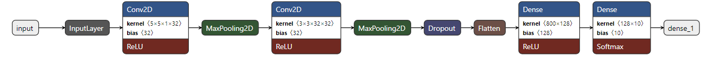
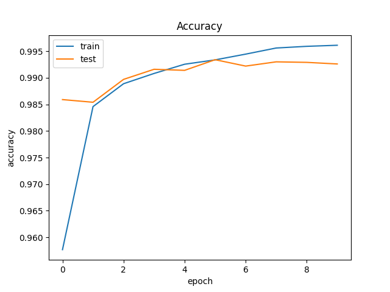
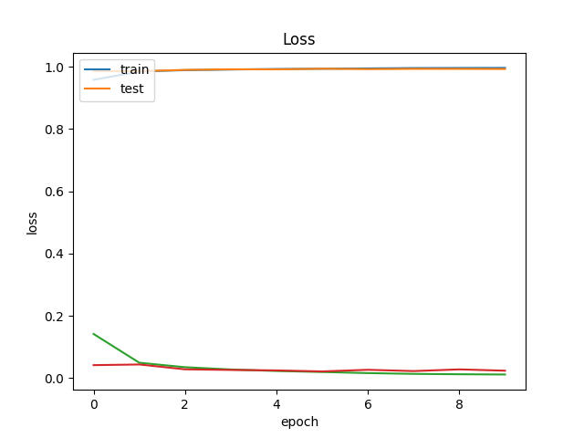
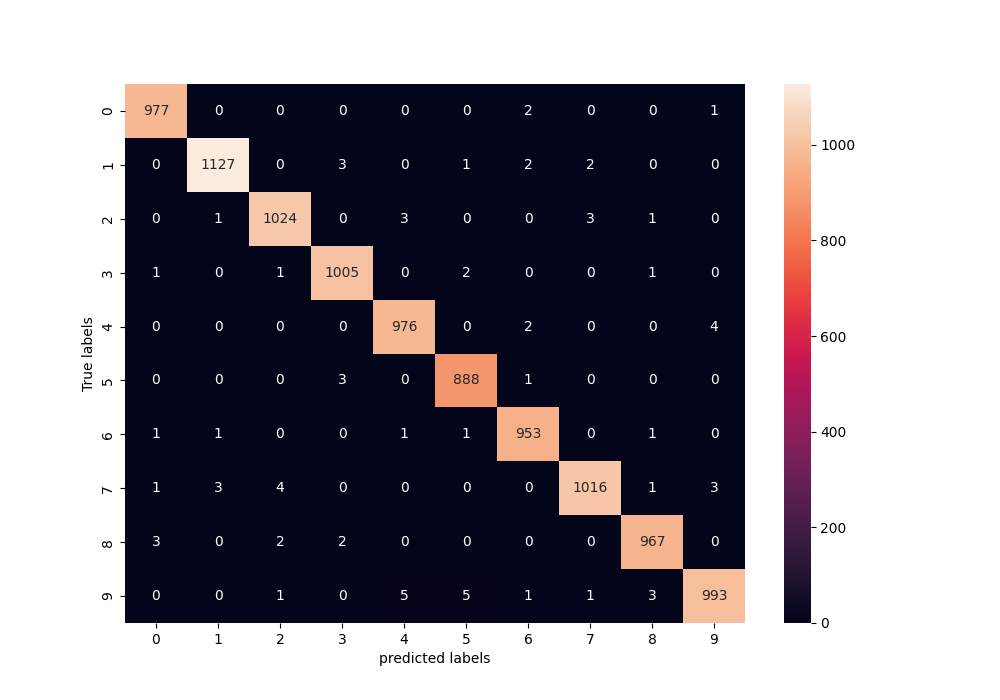
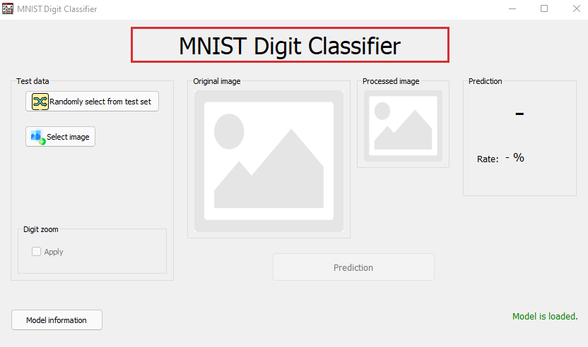
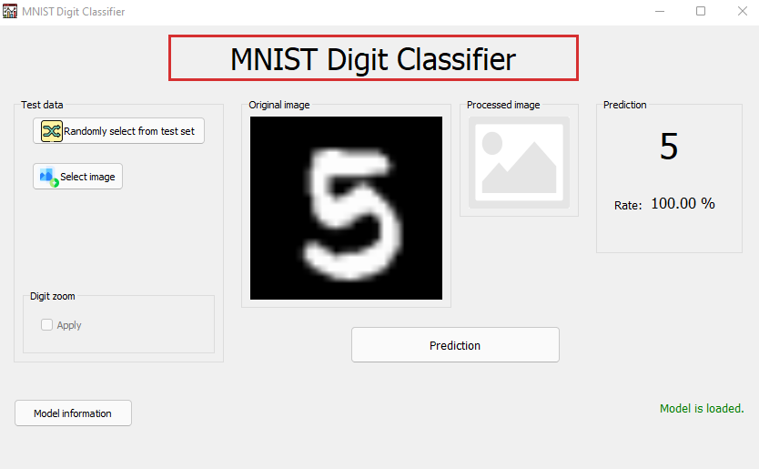
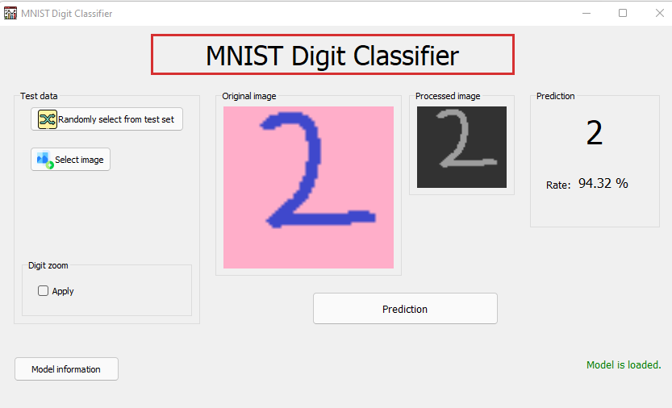
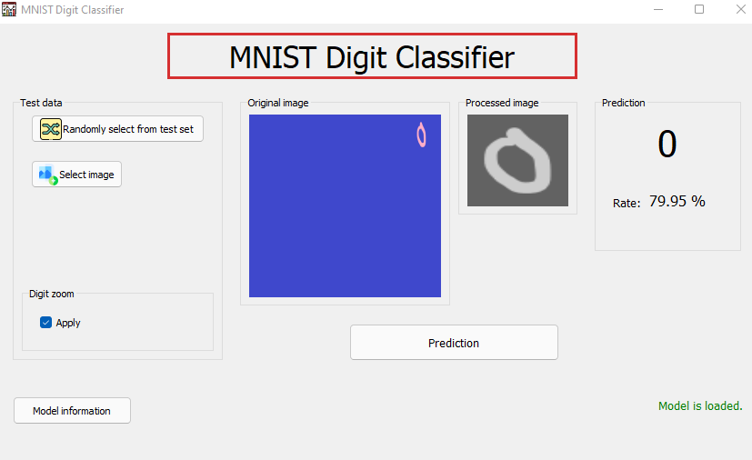

# Tensorflow MNIST Classification with PyQt5


## Used Tools
- TensorFlow
- PyQt5
- NumPy
- OpenCV
- Matplotlib
- seaborn

## Quick Installation
```
pip install -r requirements.txt
```
## Run Project
```
python mnist_classifier_ui.py
```

## Features
- Testing from model test set or external image.
- User friendly GUI.
- Digit finding and cuting.

## Model 

### Layers



### Plots
Accuracy                   |  Loss                    
:-------------------------:|:-------------------------:
  | 

Confusion Matrix
|:----------------------------:
|

## Screenshots
<p align="center">
  
  
  
   
</p>

## License
MIT


